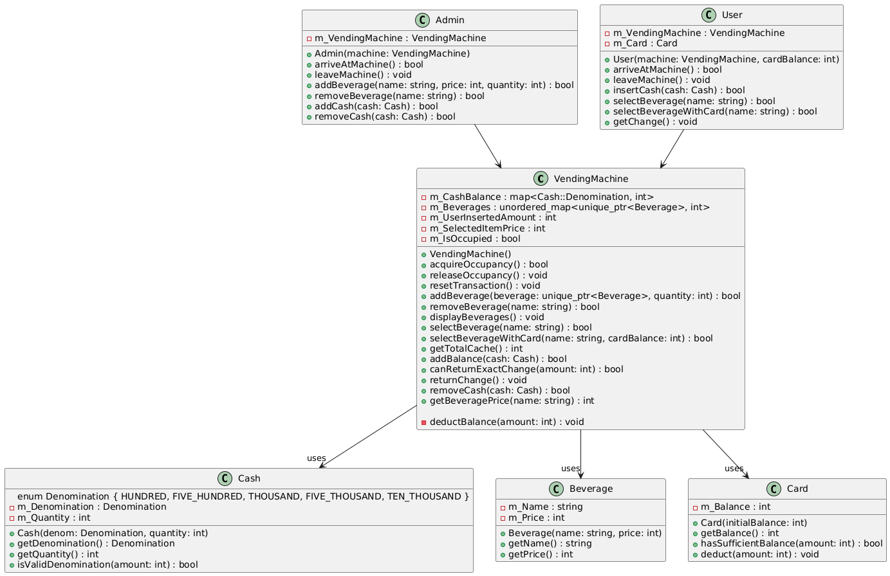
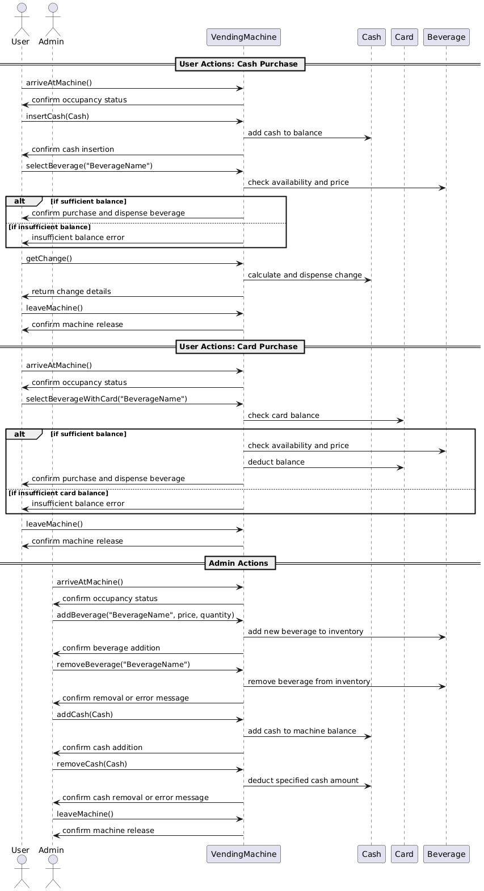
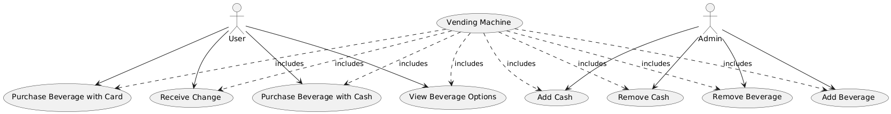

# Vending Machine Project

This project implements a vending machine simulation with functionalities for users and admins, supporting cash and card transactions, beverage management, and change handling. The project also includes a suite of tests to verify various edge cases and user interactions with the vending machine.

## Table of Contents

-   [Project Structure](#project-structure)
-   [Build Instructions](#build-instructions)
-   [Running Tests](#running-tests)
-   [Diagrams](#diagrams)
    -   [Class Diagram](#class-diagram)
    -   [Sequence Diagram](#sequence-diagram)
    -   [User Diagram](#user-diagram)
-   [Dependencies](#dependencies)

## Project Structure

```
root
├── include            # Header files for VendingMachine, User, Admin, Cash, Card, and Beverage
├── src                # Source files for the classes
├── tests              # Unit tests for the project
├── diagrams           # Contains class_diagram, sequence_diagram, and user_diagram
├── CMakeLists.txt     # CMake build file
└── README.md          # Project documentation
```

## Build Instructions

This project uses CMake to manage the build process.

### Prerequisites

Ensure the following are installed:

-   C++17 or higher
-   CMake 3.10 or higher
-   Google Test (for running tests)

### Steps

1. **Clone the Repository:**

    ```sh
    git clone <repository-url>
    cd vending-machine-project
    ```

2. **Create a Build Directory and Configure the Project:**

    ```sh
    mkdir build
    cd build
    cmake ..
    ```

3. **Build the Project:**
    ```sh
    cmake --build .
    ```

This will compile the project and generate the executable files in the `bin` directory inside `build`.

## Running Tests

The project includes a suite of tests using Google Test. After building, you can run the tests to verify the functionality of the vending machine.

1. **Navigate to the Build Directory:**

    ```sh
    cd build
    ```

2. **Run Tests Using CTest:**

    ```sh
    ctest -C Release --output-on-failure
    ```

    Alternatively, you can run the test executable directly:

    ```sh
    ./bin/VendingMachineTests
    ```

    This will display the results of all test cases, including edge cases for handling exact and insufficient change, multiple transactions, and user/admin interactions.

## Diagrams

The project includes the following diagrams to visualize the structure and interactions within the vending machine system.

### Class Diagram



The class diagram provides an overview of the classes in the project and their relationships. It shows how the `VendingMachine`, `User`, `Admin`, `Cash`, and `Beverage` classes interact, along with the primary attributes and methods for each class.

### Sequence Diagram



The sequence diagram illustrates the flow of a typical transaction in the vending machine, including user interactions such as purchasing a beverage, handling change, and notifying admins when necessary.

### User Diagram



The user diagram displays the various interactions a user or admin can have with the vending machine, such as purchasing items, inserting cash, and managing the vending machine inventory and balance.

## Dependencies

The project relies on the following libraries:

-   **Google Test**: For running unit tests on the project functionalities.

### Installing Google Test

Installing of Google Test is included in the CMakeLists.

This completes the setup, build, and test instructions. If you encounter any issues or have questions, please refer to the project documentation or open an issue on the repository.
